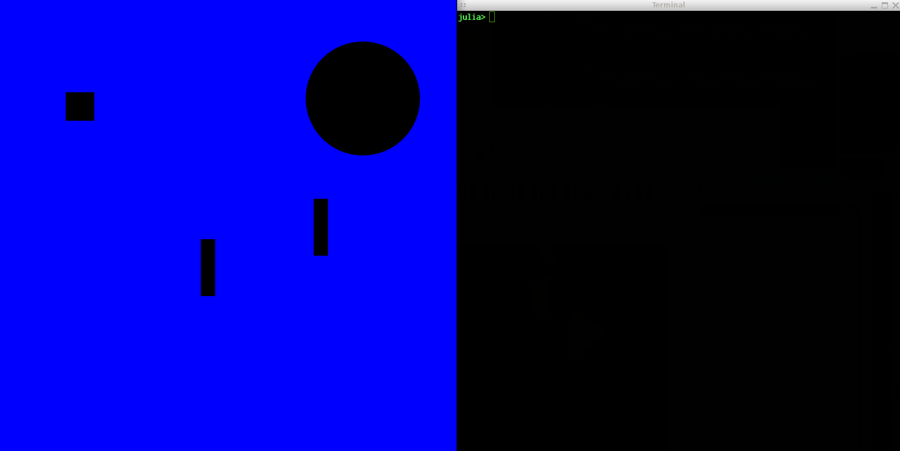

# CanvasWebIO

Warning: This package is experimental and buggy.


The purpose of this package is to allow the construction of movable SVG objects inside a WebIO Scope, with the objects having their positions accesssible through observables in Julia. 

## Installation
Install [WebIO](https://github.com/JuliaGizmos/WebIO.jl) and [JSExpr](https://github.com/JuliaGizmos/JSExpr.jl). Then run
```julia
Pkg.clone("https://github.com/lancebeet/CanvasWebIO.jl")
```
in the REPL.

## Usage
To create a canvas:

```julia
canvas = Canvas()
```

Adding movable objects using a template node:

```julia
box = dom"svg:rect[id=box, height=50, width=50, x=100, y=100]"()
addmovable!(canvas, box)
```

Serving with Mux, (canvas() returns the canvas' Scope)
```julia
using Mux
webio_serve(page("/", req -> canvas()))
```

Accessing position of movable object:
```julia
a = canvas["box"][] #access
canvas["box"] = [500,250] #assignment
```

[More examples](https://github.com/lancebeet/julia-scripts)
